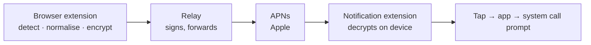

# DialBridge for iOS

[](https://github.com/gruncode/dialbridge-ios/actions/workflows/build.yml)

Click a phone number in your computer's browser; your iPhone offers to call it.

The iOS companion to [DialBridge](https://github.com/gruncode/dialbridge).
**The same browser extension drives both** — the pairing code format is shared,
so nothing on the desktop side changes when you switch phones.

> **Status:** compiles and passes its tests on macOS CI, including the check
> that CryptoKit decrypts what the browser encrypts. Not yet run on a physical
> iPhone. See [What is and isn't proven](#what-is-and-isnt-proven).

---

## How it differs from the Android version, and why

Android's DialBridge can hold its own connection to a message server, which is
what lets it avoid Google entirely. **iOS cannot do that.** Apple does not permit
background sockets, and every push must travel through Apple's own service. So
the independence the Android app offers is simply not available here — the
choice on iOS is Apple's push service or nothing.

What survives is the part that matters most: the number itself is encrypted in
the browser and decrypted on the phone, so Apple carries ciphertext it cannot
read. Same AES-256-GCM, same wire format, same pairing code.

Two smaller differences follow from the platform:

**A notification service extension does the decryption.** Since the app cannot
run in the background, the only code that gets to touch an arriving push is a
small extension. It decrypts the payload and rewrites the notification before
iOS displays it. If it fails or is skipped under memory pressure, you see
"Incoming number" rather than a wrong one.

**Dialling asks first, then calls.** `tel:` on iOS shows the system's own
confirmation and places the call; there is no public way to open the keypad
pre-filled. Combined with tapping the notification, that means two deliberate
actions before any call happens.



---

## Building

**You do not need a Mac to build or verify this project.** Every push is
compiled and tested on GitHub's macOS runners, which are free for public
repositories, and the simulator tests need no Apple Developer membership. This
project is developed on Linux; CI is what checks it.

macOS with Xcode is needed for two things: working on it interactively — the
visual editor, the debugger — and installing onto a physical iPhone from your
own machine.

Even the device install has a way round: with signing credentials in CI, the
macOS runner can archive, sign and upload to TestFlight, and you install from
there without owning a Mac. That is not configured here, but it is the usual
route for developers without Apple hardware.

To work on it locally, on a Mac:

```bash
brew install xcodegen
xcodegen generate
open DialBridge.xcodeproj
```

The Xcode project is generated from [`project.yml`](project.yml) rather than
committed: a `.pbxproj` is a machine-written blob that produces unreadable
diffs and constant merge conflicts.

For a real device you also need an Apple Developer membership (about $99 a
year), because push notifications require a provisioning profile with the push
entitlement. Set your team identifier in `project.yml`, and register the App
Group `group.com.gruncode.dialbridge` for both targets.

**Push does not work in the simulator.** The app will show "Not registered yet"
and produce no pairing code, which is correct behaviour rather than a fault.

---

## The relay

Apple requires a signed token to accept a push, and that key cannot be shipped
inside a browser extension — so a small server stands in between. It is
dependency-free: Node speaks HTTP/2 and signs ES256 without help.

```bash
cd relay
APNS_KEY="$(cat AuthKey_XXXXXXXXXX.p8)" \
APNS_KEY_ID=XXXXXXXXXX \
APNS_TEAM_ID=YYYYYYYYYY \
APNS_TOPIC=com.gruncode.dialbridge \
APNS_ENV=sandbox \
  node -e 'require("./index.js")'
```

Deploy it anywhere that runs a `(req, res)` handler — Cloud Functions, Cloud
Run, a small VM. The `.p8` key is a credential: keep it in a secret store, not
in the repository.

The relay receives a device token and a base64url blob, holds no key, keeps no
database, and logs only Apple's fault reasons — which name the problem, never
the recipient.

---

## Pairing

1. Deploy the relay and put its address in the app.
2. Wait for "Registered with Apple", then press **Generate pairing code**.
3. Copy the code and paste it into the browser extension.

The pairing code contains your encryption key. Treat it like a password, and
generate a new one to revoke a computer's access.

---

## Privacy

Same principles as the Android app: nothing collected, no analytics, no
account, numbers never stored. See [PRIVACY.md](PRIVACY.md), which also
explains the one storage decision specific to this port — the encryption key
lives in the shared app-group container so the notification extension can read
it.

---

## What is and isn't proven

Honesty about test coverage, since this is a young port:

| | Status |
|---|---|
| Relay's Apple authentication (ES256, r\|\|s encoding, token caching) | Tested — `relay/test/jwt.test.js` |
| Swift compiles, both targets link, project generates | Tested on every push — macOS CI |
| CryptoKit decrypts what the browser encrypts | Tested — `Tests/CryptoTests.swift` runs a fixture produced by the extension's own Web Crypto code |
| Tamper, wrong-key and malformed-input rejection | Tested |
| End-to-end on a physical iPhone | **Not yet** — needs a device and a paid Apple account |

The author has neither a Mac nor an iPhone; everything above is verified by
GitHub's macOS runners, which are free for public repositories. The simulator
needs no signing identity, so the tests run without an Apple Developer
membership.

If you run it on a real device, opening an issue with what happened would be
genuinely useful.

---

## Licence

MIT — see [LICENSE](LICENSE).
